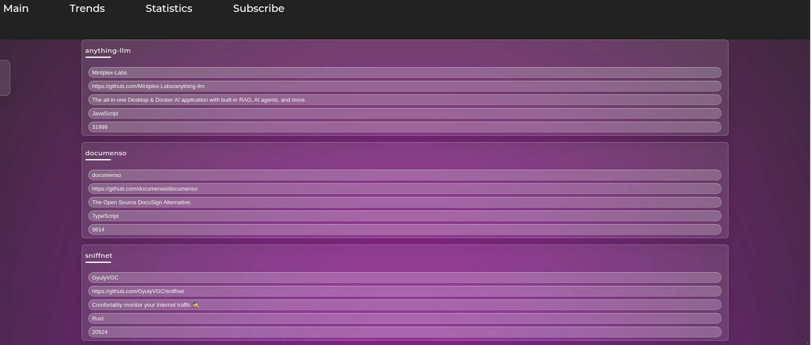
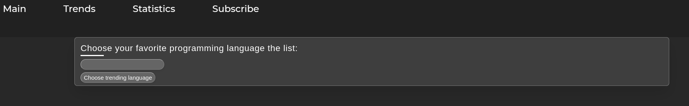

# GitHub Trends Aggregator

**GitHub Trends Aggregator** is a full-stack real-time web service that aggregates trending GitHub repositories, processes and displays them dynamically, offers filtering by language, sorting by stars, forks, current period stars, interest score. 

---

- [GitHub Trends Aggregator](#github-trends-aggregator)
  - [Overview](#overview)
  - [Features](#features)
  - [Architecture](#architecture)
  - [Endpoints](#endpoints)
  - [Installation](#installation)
    - [Running the Server](#running-the-server)
    - [Interactions in the terminal](#interactions-in-the-terminal)
    - [Docker](#docker)
  - [Technologies Used](#technologies-used)

## Overview

GitHub Trends Aggregator periodically scrapes the [GitHub Trending page](https://github.com/trending) using a resilient HTML parser and processes repository data to extract relevant metrics such as stars, forks, and a custom "interest score". The data is stored in an in-memory store and is made accessible via a RESTful API and WebSocket for live updates. An interactive client-side interface built with HTML and CSS presents the data in an *user-friendly format*, complete with filtering, sorting.

---

## Features

- **Data Aggregation:**  
  - Scrapes GitHub Trending HTML with a resilient parser using [goquery](https://github.com/PuerkitoBio/goquery). Presented in the module [fetcher](server/fetcher/fetcher.go). [Goroutine executing](server/scheduler/scheduler.go) the scraping process at one-minute intervals.  
  - Extracts essential repository information (author, name, description, language, stars, forks, period stars) and computes an additional *interest score*.

- **RESTful API Endpoints:**  
  - `GET /trends` — Retrieve the list of trending repositories with support for filtering (by programming language), sorting (stars, forks, period stars, interest score).  
  - `GET /trends/{id}` — Get detailed information about a specific repository (presented in a json format).  

- **Real-time Updates:**  
  - WebSocket support (`/ws` endpoint) to broadcast updates to connected clients immediately upon data changes.

- **Go Concurrency:**  
  - **Goroutines:** scheduled data fetching and handling multiple WebSocket connections.
  - **Mutex Locking:** The in-memory data store is protected by sync.RWMutex methods.
 
---

## Architecture

- **Backend:**  
  - Written in Go, it consists of a microservice that performs HTML scraping, data processing, and exposes RESTful endpoints.
  - Utilizes [Gorilla Mux](https://github.com/gorilla/mux) for routing and [Gorilla WebSocket](https://github.com/gorilla/websocket) for real-time communication.
  - In-memory [store](server/store/store.go) for rapid development; easily extendable to persistent databases such as PostgreSQL.

- **Frontend:**  

  
  Dynamic interface with filtering and sorting.
---

## Endpoints

- **GET /trends**  
  Retrieves trending repositories. Supports query parameters:  
  - `language` — Filter by programming language.  
  - `sort_by` — Sort by `stars`, `forks`, `current_period_stars`, or `interest_score`.  

- **GET /trends/{id}**  
  Returns detailed information for a specific repository identified by `id` presented in a json format.

- **WebSocket /ws**  
  Establish a real-time connection to receive live updates whenever new trends are broadcast.

---

## Installation

To run the server, you need to have Go 1.18+ installed on Linux.

### Running the Server

Run Makefile from the root directory:
   ```bash
   make main
   ```
   The server will start on port `8080` (browser: `http://localhost:8080`).

   Or run the server manually from the server directory:
   ```bash
   go get
   go mod tidy
   go run main.go
   ```

### Interactions in the terminal

1) Get detailed information about a specific repository:
```bash
curl http://localhost:8080/trends/1 | jq
```
`jq` will show the json in a readable format.

The response will be something like this:

```json
{
  "id": "oumi-ai/oumi",
  "secondary": 1,
  "author": "oumi-ai",
  "name": "oumi",
  "url": "https://github.com/oumi-ai/oumi",
  "description": "Everything you need to build state-of-the-art foundation models, end-to-end.",
  "language": "Python",
  "stars": 3549,
  "forks": 0,
  "current_period_stars": 1350,
  "updated_at": "2025-02-03T21:07:22.533614942+03:00",
  "interest_score": 3549
}
```

2) Connect to the WebSocket via terminal:

You need to install `wscat` first:
```bash
npm install -g wscat
```

Then connect to the WebSocket:
```bash
wscat -c ws://localhost:8080/ws
```

3) The other endpoinds have a nice representation in the browser: 




### Docker

To run the server in Docker, you need to have Docker installed on your machine.

From the root directory:
```bash
docker image build -t my_image1 ./server
docker container run -it -p 8080:8080 my_image1
```
After that, you can access the server at `http://localhost:8080`.

After you're done, you can remove the container and the image:
```bash
docker container rm -f my_container1
docker image rm -f my_image1
```

## Technologies Used

- **Backend:** Go, Gorilla Mux, Gorilla WebSocket, goquery.
- **Frontend:** HTML, CSS.

---

Feel free to explore the code. Any questions, feedback or suggestions are always welcome!

Have a good coding day!
